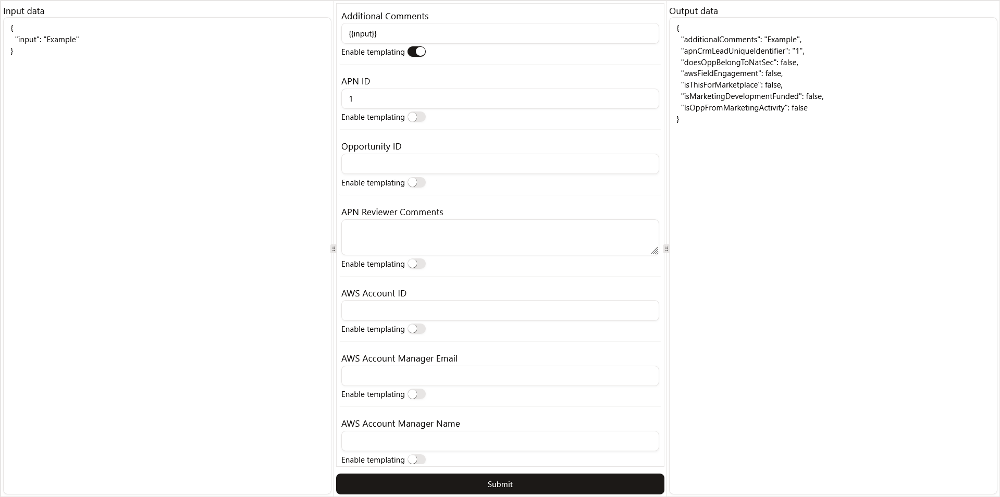

# ACE Data Mapper

This is a front-end React project done in a week (~25 hours) as a take-home assignment for a job interview.

The goal was to write a simple web app capable of mapping data from an input JSON and static values to an output object that follows the Amazon Partner Network (APN) Customer Engagements (ACE) data schema, through a [TanStack Form](https://tanstack.com/form/latest) form that supports Handlebars expressions and output validation using [Zod V4](https://zod.dev/), along with components built on top of [shadcn](https://ui.shadcn.com/). These features are tested by automated unit and e2e tests.

My goal with the current architecture was to provide a reliable dynamic structure that would only require the defined ACE Zod schema to be updated in order to accomodate for changes in ACE definitions or extend to different cloud marketplace data schemas.

## Developing

The project uses [Vite](https://vite.dev/guide/) and [React](https://react.dev/).

Start the project with `npm run dev`.

## Testing

You can run unit tests with `npm run test` and e2e tests with `npm run test:e2e`.
